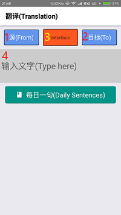
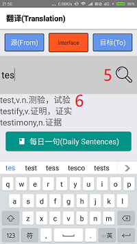
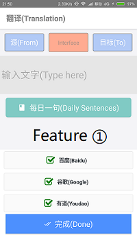
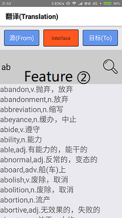
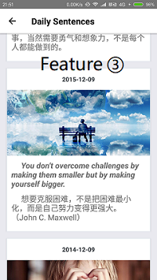
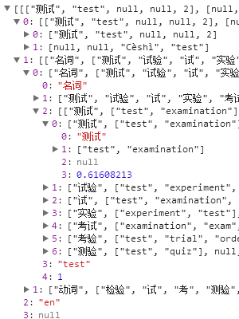
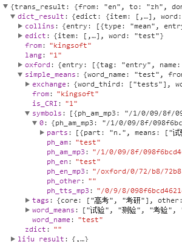
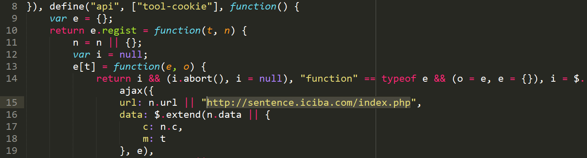

# Capstone Project: Multi-Translator

https://github.com/starhiking/react-native-translator

@YukimiNan (https://github.com/YukimiNan) @starhiking (https://github.com/starhiking)

| Student name | Student number | Responsible part |
|:------------:|:--------------:|:----------------:|
| Lan Xing     | 2015014304     | Most UI & interactive, "Translate" screen(Home.js and its children) |
| Yan Nan      | 2015014309     | All APIs("./lib"), "Daily Sentences" screen(Sentences.js and its children), local dictionary(Oxford.json) |

Document written by Yan Nan

## Project Description
This application is a translator, which gives multiple translate results simultaneously. Those results come from multiple translate engine, including:

- Google (needless to say), https://translate.google.cn/
- Baidu (largest search engine in China), http://fanyi.baidu.com/
- Youdao (professional translation engine in China, all APIs are around Chinese), http://fanyi.youdao.com/

The translate results from all APIs contain:

 - source language (that means source language can be auto-detected)
 - simple translation (for words and sentences)
 - parts of speech and more means of words
 - example sentences (if query is a word. Youdao doesn't provides this)

More, we gets more result from Google:

 - source text pronunciation
 - destination text pronunciation
 - synonyms about source word

Another feature of this application - daily sentences

That means everyday it'll display some "sentences", such as sayings, lines or diaries. Those sentences usually provides for English learners.

daily sentences data fetched from [http://news.iciba.com/](http://news.iciba.com/)

## Project Design

### UI Design
We think app's UI should like other translate websites or mobile applications, that's:

 - a textarea accommodates query text
 - a checkbox select source language (including auto-detect)
 - a checkbox select destination language

Our special feature is user can select more than one translate engines:

 - a multiple checkbox select translate engines

And a dependent screen to show daily sentences.

The screen shots please see Application Instructions part.

### Additional Research
We did a lot to handle these translate API:

 - Baidu: manually analysed through the network communication
 - Google: third-party module modified by ourselves
 - Youdao: applied for an API account at its official website

Also, we studied to use several third-party RN modules:

 - react-native-elements
 - react-native-modal-dropdown
 - react-navigation

## Application Instructions

### User Instructions
 

1. Choose source language
2. Choose destination language
3. Choose translate engine(s)
4. Input query text
5. Press "Translate" button
6. OR press auto-completed English words

### Features
  

1. Multiple translate engine, select at least one.
2. English words auto-complete, implemented by Oxford dictionary file(about 8000+ words supported).
3. Daily intensive sentences, updated everyday.

## Development Notes:

### Highlight
Nice teamwork: We discuss to encapsulated all APIs into form "function(text, from, to)", few git conflict happened when we both coding.

### Yan's part
1. RN-elements module didn't load icons: modify gradlew config manually fixed it.
2. Third-party module "google-translate-api" is written with many node-native modules. I had to replace all those modules with my own code, such as "fetch" not "got", manually construct instead of "querystring" module.
3. JSON format is not provided. I had to parsing it through try and try. See screen shots below.
4. iciba.com's daily sentences are hard to crawl. I'll explain this in Extra Credit part.

 

### Lan's part
1. Implement a textarea component which height is adaptive.
2. Complex communication between components, such as between father&son, bothers, even uncle&nephew.
3. Use array pattern matching in ES6 to use in the Flatlist

### Feature
|          Feature           |                 Implementation               |
|:--------------------------:|:--------------------------------------------:|
| Stateless Component        | commented out in the code                    |
| Stateful Component         | everywhere                                   |
| Screen Navigation          | see RootNavigator.js and TranslucentModal.js |
| Components as JS modules   | embody in "./app" folder                     |
| Networking with a REST API | all fours APIs follow it                     |

## Testing
All translate APIs(x3), all source language(x4), word&sentence(x2), are tested.

All these test cases are listed in "./\_\_test\_\_/translates.js", and had run.

In each test case, a word/sentence is translated from ALL-LANGUAGE(x4) to ALL-LANGUAGE(x4), the results are output into translate_result.txt, no exception raised. I manually checked all translation result, all conforming to expectation.

(one result is remained in translate_result.txt, you can have a look.)

(you'll find it's not "FROM ALL" but "from ['auto', '..']. Actually it was changed by me at last. I'm sure "FROM ALL" is tested.)

As for GUI, all components is tested manually, with press and console/alert, no unit test used.

## Issues
1. The result will be different, for example, a word "test", between translation from "auto" to "zh", and translation from "en" to "zh". The translation en->zh returns more details than auto->zh. Solution: when user choose auto->?, do translation twice. First detect what source language it is, then re-translate it with a specific source language.

2. Pronunciation matches Google's result, but not Baidu/Youdao's. So sometimes you'll see the pronunciation is strange.

All these issues found are fixable, if we have more time :)

## Extra Credit
When I first grabbed daily sentence website (news.iciba.com/views/dailysentence/daily.html#!/detail/title/2017-12-07), what I got was a "template webpage", critical data(the sentence) is in the form of "{{content}}". I realized it'll be fetched by AJAX.

I downloaded the JS file(confused code), Anti-confused it(at tool.chinaz.com/js.aspx), searched for urls, and I found that:

I tried a lot to run there code and successfully analysed the API out.

## Conclusion and future improvements
All required feature implemented. APIs, basic function works well. Pleasure teamwork.

### Enhancements
 - Add a server and account login. Users can keep a glossary or sentences.
 - Better GUI.
 - More language supported. (It's easy but need lots of test.)
 - More engine supported, especially some international engine, not only in China.
 - More local dictionary, not only English-Chinese.
 - Google provides pronunciation voice, introduce it.
 - voice recognition, image recognition. Baidu&Google provides its API.
